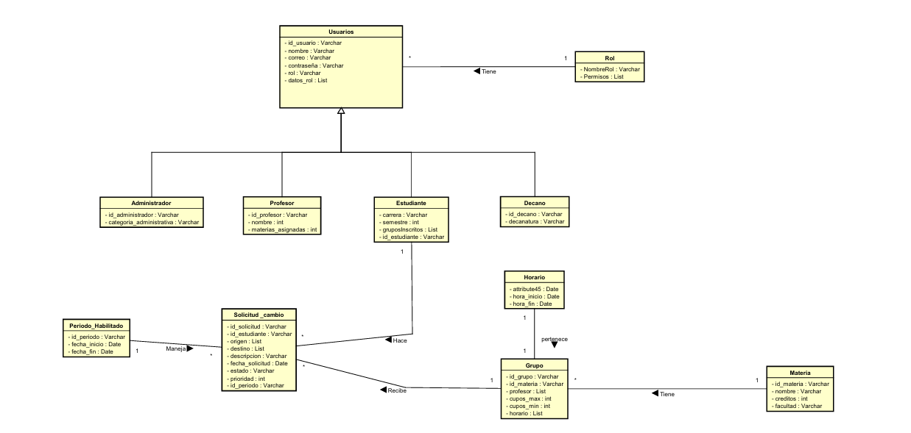
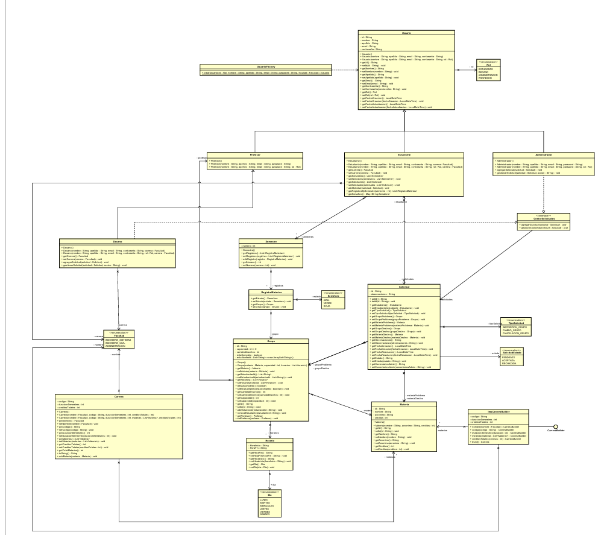
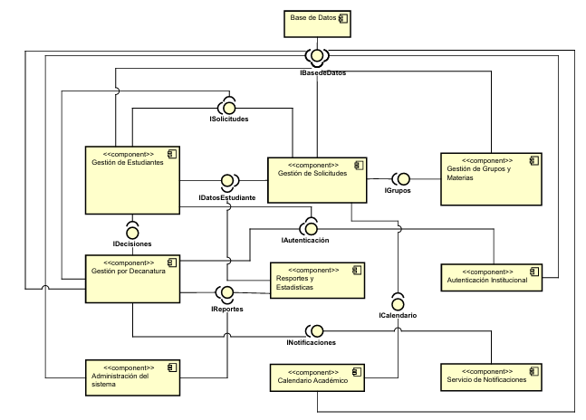
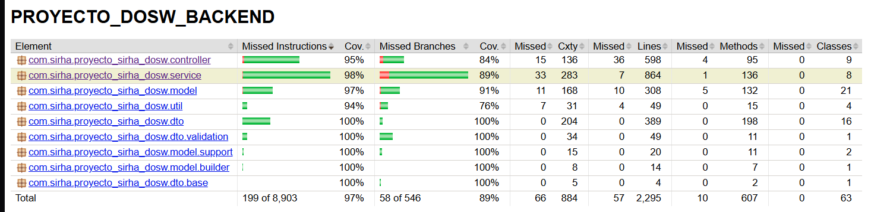
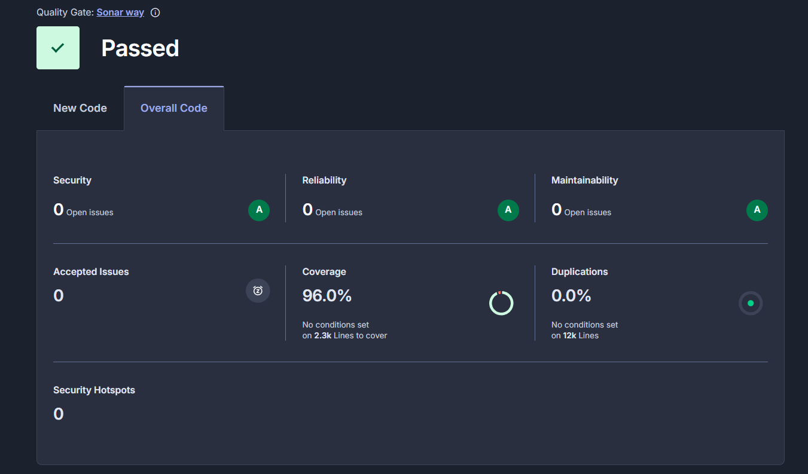
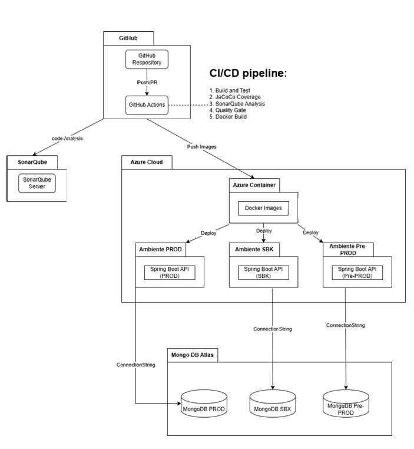

# SIRHA - Sistema de Registro de Horarios Académicos (Backend)


[](https://github.com/AlejandroHenao2572/PROYECTO_DOSW_BACKEND/actions/workflows/ci.yml)
[](https://sonarcloud.io/summary/new_code?id=AlejandroHenao2572_PROYECTO_DOSW_BACKEND)
[](https://sonarcloud.io/summary/new_code?id=AlejandroHenao2572_PROYECTO_DOSW_BACKEND)

> **API REST** desarrollada con Spring Boot para la gestión académica del Sistema Integral de Registro de Horarios Académicos (SIRHA)

## 🚀 Despliegue en Producción

### 🌐 URLs del Sistema

- **API REST en Azure**: [https://sirha-api-container.azurewebsites.net](https://sirha-api-container-dpf8cwgfbfd3c8f3.westus3-01.azurewebsites.net)
- **Documentación Swagger**: [https://sirha-api-container.azurewebsites.net/swagger-ui/index.html](https://sirha-api-container-dpf8cwgfbfd3c8f3.westus3-01.azurewebsites.net/swagger-ui/index.html#)
- **OpenAPI Docs**: [https://sirha-api-container.azurewebsites.net/v3/api-docs]((https://sirha-api-container-dpf8cwgfbfd3c8f3.westus3-01.azurewebsites.net)/v3/api-docs)

---

## 📑 Tabla de Contenidos

1. [🚀 Despliegue en Producción](#-despliegue-en-producción)
2. [👥 Miembros del Equipo](#-miembros-del-equipo)
3. [💻 Tecnologías Utilizadas](#-tecnologías-utilizadas)
4. [🎯 Funcionalidades del Sistema](#-funcionalidades-del-sistema)
5. [🏗️ Arquitectura y Patrones de Diseño](#-arquitectura-y-patrones-de-diseño)
6. [📊 Diagramas de Análisis y Diseño](#-diagramas-de-análisis-y-diseño)
7. [🧪 Pruebas Unitarias](#-pruebas-unitarias)
8. [▶️ Cómo Ejecutar el Proyecto](#-cómo-ejecutar-el-proyecto)
9. [📊 Estado del Despliegue CI/CD](#-estado-del-despliegue-cicd)
10. [🔄 Estrategia de Git Flow](#-estrategia-de-git-flow)
11. [📦 Dependencias y Configuración](#-dependencias-y-configuración)
12. [📁 Estructura del Proyecto](#-estructura-del-proyecto)

---

## 👥 Miembros del Equipo

| Nombre |
|--------|
| Anderson Fabian Garcia Nieto 
| David Alejandro Patacon Henao 
| Felipe Eduardo Calviche Gallego 
| Jared Sebastian Farfan Guevara 
| Kevin Arturo Cuitiva Pardo 
| Maria Paula Rodriguez Muñoz

---

## 💻 Tecnologías Utilizadas

### Backend Core
- **☕ Java OpenJDK 17**: Lenguaje de programación principal
- **🍃 Spring Boot 3.3.4**: Framework principal para desarrollo de aplicaciones web
- **🔐 Spring Security**: Seguridad y autenticación
- **📊 Spring Data MongoDB**: Integración con MongoDB

### Base de Datos
- **🍃 MongoDB Atlas**: Base de datos NoSQL en la nube

### Seguridad
- **🔑 JWT (JSON Web Tokens)**: Autenticación stateless
- **🔒 BCrypt**: Encriptación de contraseñas

### Documentación
- **📝 SpringDoc OpenAPI 2.6.0**: Generación automática de documentación Swagger
- **📖 Swagger UI**: Interfaz interactiva para probar la API

### Testing
- **✅ JUnit 5 (Jupiter)**: Framework de pruebas unitarias
- **🎭 Mockito**: Framework para crear mocks y stubs
- **🔍 AssertJ**: Librería para assertions más legibles
- **🧪 Spring Boot Test**: Utilidades de testing para Spring Boot
- **🔐 Spring Security Test**: Testing de seguridad

### Calidad de Código
- **📊 JaCoCo**: Análisis de cobertura de código
- **🔍 SonarCloud**: Análisis estático de código
- **✨ Lombok**: Reducción de código boilerplate

### DevOps y CI/CD
- **🐳 Docker**: Containerización de la aplicación
- **☁️ Azure Container Registry**: Registro de imágenes Docker
- **🌐 Azure App Service**: Hosting de la aplicación
- **⚙️ GitHub Actions**: CI/CD automatizado
- **📦 Maven**: Gestión de dependencias y build

### Herramientas de Desarrollo
- **📬 Postman**: Testing de API REST

---

## 🎯 Funcionalidades del Sistema

### 1. 🔐 Gestión de Autenticación y Usuarios

**Descripción**: Sistema completo de autenticación con JWT y gestión de usuarios multi-rol.

**Patrones Utilizados**:
- **Factory Pattern**: `UsuarioFactory` para crear instancias de usuarios según su rol
- **Strategy Pattern**: Diferentes estrategias de validación según el tipo de usuario
- **Singleton Pattern**: `PlazoSolicitudes` para gestionar períodos habilitados

**Funcionalidades**:
- ✅ Registro de usuarios (Estudiante, Decano, Profesor, Administrador)
- ✅ Login con generación de JWT
- ✅ Generación automática de email institucional
- ✅ Encriptación de contraseñas con BCrypt
- ✅ Validación de contraseñas seguras
- ✅ Autorización basada en roles (RBAC)

**Endpoints**: `/api/auth/register`, `/api/auth/login`

---

### 2. 📚 Gestión de Horarios Académicos

**Descripción**: Consulta y gestión de horarios por estudiante y semestre.

**Patrones Utilizados**:
- **Builder Pattern**: `GrupoBuilder`, `MateriaBuilder` para construcción de objetos complejos
- **Repository Pattern**: Abstracción del acceso a datos
- **DTO Pattern**: Transferencia de datos entre capas

**Funcionalidades**:
- ✅ Consulta de horario por semestre
- ✅ Visualización de materias y grupos inscritos
- ✅ Información detallada de horarios (día, hora, salón)
- ✅ Cancelación de materias

**Endpoints**: 
- `GET /api/estudiante/horario/{idEstudiante}/{semestre}`
- `PUT /api/estudiante/materias/{idEstudiante}/{acronimoMateria}/cancelar`

---

### 3. 🚦 Sistema de Semáforo Académico

**Descripción**: Indicador visual del rendimiento académico del estudiante.

**Patrones Utilizados**:
- **State Pattern**: Estados del semáforo (VERDE, AZUL, ROJO)
- **Observer Pattern**: Notificación de cambios en el estado académico

**Funcionalidades**:
- ✅ Cálculo automático del estado académico
- ✅ Indicadores de rendimiento por período
- ✅ Alertas tempranas de bajo rendimiento
- ✅ Seguimiento histórico por semestre

**Estados del Semáforo**:
- 🟢 **VERDE**: Buen rendimiento académico
- 🔵 **AZUL**: Rendimiento medio, requiere atención
- 🔴 **ROJO**: Bajo rendimiento, riesgo académico

**Endpoints**: `GET /api/estudiante/semaforo/{idEstudiante}`

---

### 4. 📝 Gestión de Solicitudes de Cambio

**Descripción**: Sistema completo para solicitudes de cambio de grupo entre estudiantes.

**Patrones Utilizados**:
- **Chain of Responsibility**: Cadena de validación de solicitudes
- **State Pattern**: Estados de la solicitud (PENDIENTE, EN_REVISION, APROBADA, RECHAZADA)
- **Command Pattern**: Encapsulación de acciones sobre solicitudes
- **Singleton Pattern**: `PlazoSolicitudes` para control de fechas

**Funcionalidades**:
- ✅ Creación de solicitudes de cambio de grupo
- ✅ Validación automática de cupos disponibles
- ✅ Verificación de conflictos de horario
- ✅ Consulta de solicitudes por estudiante
- ✅ Filtrado de solicitudes por estado
- ✅ Aprobación/rechazo por parte de Decanos
- ✅ Control de plazos para solicitudes

**Endpoints**:
- `POST /api/estudiante/solicitudes`
- `GET /api/estudiante/solicitudes/{idEstudiante}`
- `GET /api/estudiante/solicitudes/{idEstudiante}/{solicitudId}`
- `GET /api/estudiante/solicitudes/estado/{estado}`
- `PUT /api/decano/solicitudes/{solicitudId}/aprobar`
- `PUT /api/decano/solicitudes/{solicitudId}/rechazar`

---

### 5. 👨‍🎓 Gestión de Grupos y Materias

**Descripción**: Administración completa de grupos académicos y materias.

**Patrones Utilizados**:
- **Builder Pattern**: Construcción flexible de objetos Grupo y Materia
- **Repository Pattern**: Acceso abstracto a la base de datos
- **Facade Pattern**: Simplificación de operaciones complejas

**Funcionalidades**:
- ✅ Consulta de grupos por materia
- ✅ Información de cupos disponibles
- ✅ Asignación de profesores a grupos
- ✅ Gestión de horarios de clase
- ✅ Consulta de carreras y facultades

**Endpoints**:
- `GET /api/grupos`
- `GET /api/grupos/{idGrupo}`
- `GET /api/materias`
- `GET /api/carreras`

---

### 6. 📊 Reportes y Estadísticas

**Descripción**: Generación de reportes académicos y estadísticas para decanos.

**Patrones Utilizados**:
- **Template Method Pattern**: Plantillas para diferentes tipos de reportes
- **Strategy Pattern**: Diferentes estrategias de cálculo de métricas

**Funcionalidades**:
- ✅ Tasa de aprobación por materia
- ✅ Estadísticas de grupos (ocupación, rendimiento)
- ✅ Monitoreo de capacidad de grupos
- ✅ Indicadores de avance curricular
- ✅ Disponibilidad de grupos por materia

**Endpoints**:
- `GET /api/reportes/tasa-aprobacion`
- `GET /api/reportes/estadisticas-grupos`
- `GET /api/reportes/capacidad-grupos`
- `GET /api/reportes/indicadores-avance`

---

### 7. 👤 Gestión de Usuarios 

**Descripción**: Administración  de usuarios del sistema.

**Patrones Utilizadas**:
- **Factory Pattern**: Creación de usuarios según rol

**Funcionalidades**:
- ✅ Listar todos los usuarios
- ✅ Buscar usuarios por ID
- ✅ Actualizar información de usuarios
- ✅ Eliminar usuarios
- ✅ Gestión de roles y permisos

**Endpoints**:
- `GET /api/usuarios`
- `GET /api/usuarios/{id}`
- `PUT /api/usuarios/{id}`
- `DELETE /api/usuarios/{id}`

---

## 🏗️ Arquitectura y Patrones de Diseño

### Arquitectura en Capas (MVC)

```
┌─────────────────────────────────────────────────────┐
│             CAPA DE PRESENTACIÓN                    │
│  ┌──────────────────────────────────────────────┐  │
│  │   Controllers (REST API Endpoints)            │  │
│  │   - AuthController                            │  │
│  │   - EstudianteController                      │  │
│  │   - DecanoController                          │  │
│  │   - GrupoController                           │  │
│  │   - UsuarioController                         │  │
│  └──────────────────────────────────────────────┘  │
└─────────────────────────────────────────────────────┘
                        ↓
┌─────────────────────────────────────────────────────┐
│          CAPA DE TRANSFERENCIA DE DATOS             │
│  ┌──────────────────────────────────────────────┐  │
│  │   DTOs (Data Transfer Objects)                │  │
│  │   - UsuarioDTO, SolicitudDTO                  │  │
│  │   - AuthRequestDTO, AuthResponseDTO           │  │
│  │   - GrupoDTO, MateriaDTO                      │  │
│  └──────────────────────────────────────────────┘  │
└─────────────────────────────────────────────────────┘
                        ↓
┌─────────────────────────────────────────────────────┐
│              CAPA DE NEGOCIO                        │
│  ┌──────────────────────────────────────────────┐  │
│  │   Services (Lógica de Negocio)                │  │
│  │   - AuthService                               │  │
│  │   - EstudianteService                         │  │
│  │   - DecanoService                             │  │
│  │   - GrupoService                              │  │
│  │   - UsuarioService                            │  │
│  └──────────────────────────────────────────────┘  │
└─────────────────────────────────────────────────────┘
                        ↓
┌─────────────────────────────────────────────────────┐
│           CAPA DE ACCESO A DATOS                    │
│  ┌──────────────────────────────────────────────┐  │
│  │   Repositories (MongoDB)                      │  │
│  │   - UsuarioRepository                         │  │
│  │   - SolicitudRepository                       │  │
│  │   - GrupoRepository                           │  │
│  │   - MateriaRepository                         │  │
│  └──────────────────────────────────────────────┘  │
└─────────────────────────────────────────────────────┘
                        ↓
┌─────────────────────────────────────────────────────┐
│                 BASE DE DATOS                       │
│            MongoDB Atlas (Cloud)                    │
└─────────────────────────────────────────────────────┘
```

### Patrones de Diseño Implementados

#### 1. **Creational Patterns (Patrones Creacionales)**

##### Factory Pattern
**Ubicación**: `model/UsuarioFactory.java`

**Propósito**: Crear instancias de usuarios según su rol sin exponer la lógica de creación.

```java
/**
 * Factory para crear diferentes tipos de usuarios según su rol.
 * Permite crear Estudiante, Decano, Profesor o Administrador.
 */
public class UsuarioFactory {
    public static Usuario crearUsuario(UsuarioDTO dto) {
        return switch (dto.getRol()) {
            case ESTUDIANTE -> new Estudiante(dto);
            case DECANO -> new Decano(dto);
            case PROFESOR -> new Profesor(dto);
            case ADMINISTRADOR -> new Administrador(dto);
        };
    }
}
```

##### Builder Pattern
**Ubicación**: `model/builder/GrupoBuilder.java`, `MateriaBuilder.java`

**Propósito**: Construcción paso a paso de objetos complejos.

```java
/**
 * Builder para construir objetos Grupo de forma fluida.
 */
public class GrupoBuilder {
    private String id;
    private Materia materia;
    private Profesor profesor;
    private List<Horario> horarios;
    
    public GrupoBuilder withId(String id) {
        this.id = id;
        return this;
    }
    
    public Grupo build() {
        return new Grupo(id, materia, profesor, horarios);
    }
}
```

##### Singleton Pattern
**Ubicación**: `model/PlazoSolicitudes.java`

**Propósito**: Garantizar una única instancia del control de plazos.

```java
/**
 * Singleton que gestiona el período habilitado para crear solicitudes.
 */
public class PlazoSolicitudes {
    public static final PlazoSolicitudes INSTANCIA = new PlazoSolicitudes();
    
    private LocalDate fechaInicio;
    private LocalDate fechaFin;
    
    private PlazoSolicitudes() {}
    
    public boolean estaEnPlazo(LocalDate fecha) {
        return !fecha.isBefore(fechaInicio) && !fecha.isAfter(fechaFin);
    }
}
```

#### 2. **Structural Patterns (Patrones Estructurales)**

##### Repository Pattern
**Ubicación**: `repository/*Repository.java`

**Propósito**: Abstracción del acceso a datos.

```java
/**
 * Repositorio para operaciones CRUD de usuarios en MongoDB.
 */
@Repository
public interface UsuarioRepository extends MongoRepository<Usuario, String> {
    Optional<Usuario> findByEmail(String email);
    List<Usuario> findByRol(Rol rol);
}
```

##### DTO Pattern (Data Transfer Object)
**Ubicación**: `dto/*.java`

**Propósito**: Transferir datos entre capas sin exponer entidades.

```java
/**
 * DTO para transferir datos de usuario entre capas.
 * Separa la representación externa de la entidad interna.
 */
public class UsuarioDTO {
    private String nombre;
    private String apellido;
    private String password;
    private Rol rol;
    private Facultad facultad;
}
```

##### Facade Pattern
**Ubicación**: `service/*Service.java`

**Propósito**: Proporcionar una interfaz simplificada para operaciones complejas.

#### 3. **Behavioral Patterns (Patrones de Comportamiento)**

##### State Pattern
**Ubicación**: `model/SolicitudEstado.java`, `model/Semaforo.java`

**Propósito**: Cambiar el comportamiento según el estado del objeto.

```java
/**
 * Estados posibles de una solicitud.
 */
public enum SolicitudEstado {
    PENDIENTE,      // Recién creada
    EN_REVISION,    // Siendo evaluada
    APROBADA,       // Aceptada por el decano
    RECHAZADA       // Rechazada por el decano
}
```

##### Strategy Pattern
**Ubicación**: `dto/validation/*`

**Propósito**: Definir diferentes algoritmos de validación.

##### Chain of Responsibility
**Ubicación**: `service/EstudianteService.crearSolicitud()`

**Propósito**: Cadena de validaciones para crear solicitudes.

```java
// 1. Validar plazo
// 2. Validar cupos disponibles
// 3. Validar conflictos de horario
// 4. Crear solicitud
```

---

---

## 📊 Diagramas de Análisis y Diseño

### Scafolding:
```
PROYECTO_DOSW_BACKEND/
docs #Documentacion del proyecto
│   └───UML #Diagramas UML
│       └───Requerimientos #Documentos con requereimientos
├───src #Codigo fuente principal
│   ├───main #Codigo principal de la aplicacion
│   │   ├───java
│   │   │   └───com
│   │   │       └───sirha
│   │   │           └───proyecto_sirha_dosw
│   │   │               ├───config #configuraciones
│   │   │               ├───controller #Controladores REST
│   │   │               ├───dto #Data Transfer Objects 
│   │   │               ├───exception #Manejo de excepciones
│   │   │               ├───model #Modelos de datos/entidades
│   │   │               ├───repository #Repositorios para acceso a datos
│   │   │               └───service #Logica de negocio 
│   │   └───resources
│   └───test #Codigo de pruebas 
│       └───java
│           └───com
│               └───sirha
│                   └───proyecto_sirha_dosw
└── README.md
├── pom.xml
```

### Diagrama de datos:  
  

### Diagrama de clases:  
  

### Diagrama de Componentes:  
  

## Diagramas de Secuencia:  
Todos los diagramas de secuencia se encuentran en la carpeta docs/DiagramasSecuencia

---

## 🧪 Pruebas Unitarias

### Estrategia de Testing

El proyecto implementa pruebas unitarias con una cobertura superior al **80%**.

### Frameworks y Herramientas

- **JUnit 5 (Jupiter)**: Framework principal de pruebas
- **Mockito**: Mocking de dependencias
- **AssertJ**: Assertions fluidas y legibles
- **Spring Boot Test**: Testing de contexto Spring
- **Spring Security Test**: Testing de seguridad
- **JaCoCo**: Medición de cobertura de código

### Estructura de Pruebas

```
src/test/java/com/sirha/proyecto_sirha_dosw/
├── config/
│   └── DataSeedTest.java
├── controller/
│   ├── AuthControllerTest.java
│   ├── EstudianteControllerTest.java
│   ├── DecanoControllerTest.java
│   ├── GrupoControllerTest.java
│   ├── UsuarioControllerTest.java
│   └── ReportesControllerTest.java
├── service/
│   ├── AuthServiceTest.java
│   ├── EstudianteServiceTest.java
│   ├── DecanoServiceTest.java
│   ├── GrupoServiceTest.java
│   └── UsuarioServiceTest.java
├── dto/
│   ├── UsuarioDTOTest.java
│   ├── SolicitudDTOTest.java
│   └── (otros DTOs...)
└── model/
    ├── UsuarioTest.java
    ├── SolicitudTest.java
    └── (otros modelos...)
```

### Ejecución de Pruebas

#### 🖥️ Ejecutar todas las pruebas

```bash
# Con Maven instalado
mvn test
```

#### 📊 Ejecutar pruebas con reporte de cobertura

```bash
# Generar reporte JaCoCo
./mvnw clean test jacoco:report

# El reporte HTML se genera en:
# target/site/jacoco/index.html
```


### Cobertura de Código




1. **Generar el reporte**:
```bash
./mvnw clean test jacoco:report
```

2. **Abrir el reporte HTML**:
```bash
# Windows
start target/site/jacoco/index.html

# Linux/Mac
open target/site/jacoco/index.html
```

3. **Ver en SonarCloud**:


### Configuración de JaCoCo

El proyecto está configurado para:
- ✅ Generar reportes XML y HTML
- ✅ Verificar cobertura mínima del 80%
- ✅ Excluir clases de configuración
- ✅ Excluir clases de excepción
- ✅ Integración con SonarCloud

```xml
<!-- Configuración en pom.xml -->
<plugin>
    <groupId>org.jacoco</groupId>
    <artifactId>jacoco-maven-plugin</artifactId>
    <version>0.8.12</version>
    <configuration>
        <excludes>
            <exclude>**/exception/**</exclude>
            <exclude>**/config/**</exclude>
            <exclude>**/*ProyectoSirhaApplication.class</exclude>
        </excludes>
    </configuration>
    <executions>
        <execution>
            <id>jacoco-check</id>
            <goals>
                <goal>check</goal>
            </goals>
            <configuration>
                <rules>
                    <rule>
                        <limits>
                            <limit>
                                <counter>INSTRUCTION</counter>
                                <value>COVEREDRATIO</value>
                                <minimum>0.80</minimum>
                            </limit>
                        </limits>
                    </rule>
                </rules>
            </configuration>
        </execution>
    </executions>
</plugin>
```
---

## ▶️ Cómo Ejecutar el Proyecto

### Prerrequisitos

- ☕ **Java 17** o superior
- 📦 **Maven 3.8+** (o usar el wrapper incluido)
- 🍃 **MongoDB Atlas** (credenciales configuradas)
- 🐳 **Docker** (opcional, para containerización)

### Opción 1: Ejecución Local con Maven

#### 1. Clonar el repositorio

```bash
git clone https://github.com/AlejandroHenao2572/PROYECTO_DOSW_BACKEND.git
cd PROYECTO_DOSW_BACKEND
```

#### 2. Configurar variables de entorno 

Crear archivo `.env` o configurar en el sistema:

```properties
MONGODB_URI=(URI generada en Altlas Mongo DB)
JWT_SECRET=your-secret-key-here
JWT_EXPIRATION=86400000
```

#### 3. Compilar el proyecto

```bash
# Con Maven instalado
mvn clean install
```

#### 4. Ejecutar la aplicación

```bash
mvn spring-boot:run


#### 5. Verificar que la aplicación está corriendo

Abrir en el navegador:
- **API**: http://localhost:8080
- **Swagger UI**: http://localhost:8080/swagger-ui/index.html
- **Health Check**: http://localhost:8080/actuator/health

---

### Opción 2: Ejecución con Docker

#### 1. Construir la imagen Docker

```bash
docker build -t sirha-api:latest .
```

#### 2. Ejecutar el contenedor

```bash
docker run -d \
  -p 8080:8080 \
  --name sirha-api \
  -e MONGODB_URI="mongodb+srv://..." \
  sirha-api:latest
```

#### 3. Ver logs del contenedor

```bash
docker logs -f sirha-api
```

#### 4. Detener y eliminar el contenedor

```bash
docker stop sirha-api
docker rm sirha-api
```

---

### Opción 3: Ejecución con Docker Compose

#### 1. Crear archivo `docker-compose.yml` (ya incluido)

```yaml
version: '3.8'

services:
  sirha-api:
    build: .
    ports:
      - "8080:8080"
    environment:
      - MONGODB_URI=${MONGODB_URI}
      - JWT_SECRET=${JWT_SECRET}
    restart: unless-stopped
```

#### 2. Ejecutar con Docker Compose

```bash
docker-compose up -d
```

#### 3. Ver logs

```bash
docker-compose logs -f
```

#### 4. Detener los servicios

```bash
docker-compose down
```

---

#### Ejecutar análisis de SonarCloud

```bash
./mvnw clean verify sonar:sonar 
  -Dsonar.token=(Token de proyecto generado en Sonar)
```
---
### 📊 Estado del Despliegue CI/CD

El proyecto cuenta con **2 pipelines automatizados** configurados en GitHub Actions:

#### 1️⃣ Pipeline de Desarrollo (CI)
- **Archivo**: `.github/workflows/ci.yml`
- **Trigger**: Push y Pull Requests a la rama `develop`
- **Acciones**:
  - ✅ Compilación del proyecto con Maven
  - ✅ Ejecución de pruebas unitarias
  - ✅ Generación de reporte de cobertura con JaCoCo
  - ✅ Análisis de calidad de código con SonarCloud
  - ✅ Validación de Quality Gate

#### 2️⃣ Pipeline de Producción (CD)
- **Archivo**: `.github/workflows/deploy.yml`
- **Trigger**: Pull Requests cerrados (merged) a `develop` o `main`
- **Acciones**:
  - 🐳 Construcción de imagen Docker
  - 📦 Push a Azure Container Registry (ACR)
  - 🚀 Despliegue automático a Azure App Service
  - 🔄 Actualización del contenedor en producción

### Diagrama de Despliegue:  

---

## 🔄 Estrategia de Git Flow

El proyecto sigue la estrategia Git Flow para gestión de ramas y releases.

### Ramas Principales

#### 1. `main` - Producción
- ✅ Código en producción
- ✅ Siempre estable y desplegable
- ✅ Solo se fusiona desde `release/*` o `hotfix/*`

#### 2. `develop` - Desarrollo
- ✅ Rama principal de desarrollo
- ✅ Integración de nuevas funcionalidades
- ✅ Base para crear ramas `feature/*`
- ✅ Pipeline CI ejecuta en cada push

### Ramas de Soporte

#### 3. `feature/*` - Nuevas Funcionalidades

Creación y uso:
```bash
# Crear nueva feature desde develop
git checkout develop
git pull origin develop
git checkout -b feature/nombre-funcionalidad

# Trabajar en la feature
git add .
git commit -m "feat: descripción del cambio"

# Push a remote
git push origin feature/nombre-funcionalidad

# Crear Pull Request a develop
```

**Convención de nombres**:
- `feature/autenticacion-jwt`
- `feature/gestion-solicitudes`
- `feature/reportes-decano`

#### 4. `hotfix/*` - Correcciones Urgentes

Para bugs críticos en producción:
```bash
# Crear hotfix desde main
git checkout main
git pull origin main
git checkout -b hotfix/descripcion-bug

# Corregir el bug
git add .
git commit -m "fix: descripción del fix"

# Fusionar en main Y develop
git checkout main
git merge hotfix/descripcion-bug
git push origin main

git checkout develop
git merge hotfix/descripcion-bug
git push origin develop

# Eliminar rama
git branch -d hotfix/descripcion-bug
```

### Convenciones de Commits (Conventional Commits)

Seguimos el estándar [Conventional Commits](https://www.conventionalcommits.org/):

```
<tipo>[alcance opcional]: <descripción>

[cuerpo opcional]

[footer opcional]
```

**Tipos de commits**:
- `feat`: Nueva funcionalidad
- `fix`: Corrección de bugs
- `docs`: Cambios en documentación
- `style`: Formato de código (sin cambios de lógica)
- `refactor`: Refactorización de código
- `test`: Agregar o modificar tests
- `chore`: Mantenimiento (dependencias, configuración)
- `perf`: Mejoras de rendimiento
- `ci`: Cambios en CI/CD
- `build`: Cambios en el sistema de build

### Protección de Ramas

#### `main`
- ✅ Requiere Pull Request
- ✅ Requiere aprobación de 1 revisor
- ✅ Requiere que CI pase
- ✅ No permite force push
- ✅ No permite eliminación

#### `develop`
- ✅ Requiere Pull Request
- ✅ Requiere que CI pase
- ✅ No permite force push

---

## 📦 Dependencias y Configuración

### Dependencias Principales

```xml
<dependencies>
    <!-- Spring Boot -->
    <dependency>
        <groupId>org.springframework.boot</groupId>
        <artifactId>spring-boot-starter-web</artifactId>
        <version>3.3.4</version>
    </dependency>
    
    <!-- MongoDB -->
    <dependency>
        <groupId>org.springframework.boot</groupId>
        <artifactId>spring-boot-starter-data-mongodb</artifactId>
        <version>3.3.4</version>
    </dependency>
    
    <!-- Security -->
    <dependency>
        <groupId>org.springframework.boot</groupId>
        <artifactId>spring-boot-starter-security</artifactId>
        <version>3.3.4</version>
    </dependency>
    
    <!-- JWT -->
    <dependency>
        <groupId>io.jsonwebtoken</groupId>
        <artifactId>jjwt-api</artifactId>
        <version>0.11.5</version>
    </dependency>
    
    <!-- Validation -->
    <dependency>
        <groupId>org.springframework.boot</groupId>
        <artifactId>spring-boot-starter-validation</artifactId>
        <version>3.3.4</version>
    </dependency>
    
    <!-- Lombok -->
    <dependency>
        <groupId>org.projectlombok</groupId>
        <artifactId>lombok</artifactId>
        <version>1.18.42</version>
        <scope>provided</scope>
    </dependency>
    
    <!-- SpringDoc OpenAPI -->
    <dependency>
        <groupId>org.springdoc</groupId>
        <artifactId>springdoc-openapi-starter-webmvc-ui</artifactId>
        <version>2.6.0</version>
    </dependency>
    
    <!-- Testing -->
    <dependency>
        <groupId>org.springframework.boot</groupId>
        <artifactId>spring-boot-starter-test</artifactId>
        <scope>test</scope>
    </dependency>
</dependencies>
```

### Plugins de Maven

```xml
<plugins>
    <!-- Spring Boot Plugin -->
    <plugin>
        <groupId>org.springframework.boot</groupId>
        <artifactId>spring-boot-maven-plugin</artifactId>
    </plugin>
    
    <!-- JaCoCo Plugin (Cobertura) -->
    <plugin>
        <groupId>org.jacoco</groupId>
        <artifactId>jacoco-maven-plugin</artifactId>
        <version>0.8.12</version>
    </plugin>
    
    <!-- SonarCloud Plugin -->
    <plugin>
        <groupId>org.sonarsource.scanner.maven</groupId>
        <artifactId>sonar-maven-plugin</artifactId>
        <version>4.0.0.4121</version>
    </plugin>
    
    <!-- Maven Compiler Plugin -->
    <plugin>
        <groupId>org.apache.maven.plugins</groupId>
        <artifactId>maven-compiler-plugin</artifactId>
        <version>3.13.0</version>
        <configuration>
            <source>17</source>
            <target>17</target>
        </configuration>
    </plugin>
</plugins>
```

## 📁 Estructura del Proyecto

```
PROYECTO_DOSW_BACKEND/
│
├── .github/                        # GitHub Actions workflows
│   ├── workflows/
│   │   ├── ci.yml                 # Pipeline de CI (desarrollo)
│   │   └── deploy.yml             # Pipeline de CD (producción)
│   └── java-upgrade/              # Configuración de upgrades
│
├── docs/                          # Documentación del proyecto
│   └── UML/                       # Diagramas UML
│       ├── SIRHA-UML.asta        # Archivo Astah
│       ├── diagramasSecuencia/   # Diagramas de secuencia
│       └── Requerimientos/       # Documentos de requerimientos
│
├── src/
│   ├── main/
│   │   ├── java/com/sirha/proyecto_sirha_dosw/
│   │   │   ├── ProyectoSirhaApplication.java  # Clase principal
│   │   │   │
│   │   │   ├── config/            # Configuraciones
│   │   │   │   ├── CorsConfig.java
│   │   │   │   ├── SecurityConfig.java
│   │   │   │   ├── JwtService.java
│   │   │   │   ├── JwtAuthFilter.java
│   │   │   │   ├── CustomUserDetailsService.java
│   │   │   │   └── DataSeed.java  # Datos de prueba
│   │   │   │
│   │   │   ├── controller/        # Controladores REST
│   │   │   │   ├── AuthController.java
│   │   │   │   ├── EstudianteController.java
│   │   │   │   ├── DecanoController.java
│   │   │   │   ├── GrupoController.java
│   │   │   │   ├── MateriaController.java
│   │   │   │   ├── UsuarioController.java
│   │   │   │   └── ReportesController.java
│   │   │   │
│   │   │   ├── dto/               # Data Transfer Objects
│   │   │   │   ├── UsuarioDTO.java
│   │   │   │   ├── AuthRequestDTO.java
│   │   │   │   ├── AuthResponseDTO.java
│   │   │   │   ├── SolicitudDTO.java
│   │   │   │   ├── GrupoDTO.java
│   │   │   │   ├── MateriaDTO.java
│   │   │   │   ├── validation/    # Validadores personalizados
│   │   │   │   └── base/          # DTOs base
│   │   │   │
│   │   │   ├── exception/         # Manejo de excepciones
│   │   │   │   ├── GlobalExceptionHandler.java
│   │   │   │   ├── SirhaException.java
│   │   │   │   └── Log.java
│   │   │   │
│   │   │   ├── model/             # Entidades del dominio
│   │   │   │   ├── Usuario.java
│   │   │   │   ├── Estudiante.java
│   │   │   │   ├── Decano.java
│   │   │   │   ├── Profesor.java
│   │   │   │   ├── Administrador.java
│   │   │   │   ├── UsuarioFactory.java
│   │   │   │   ├── Solicitud.java
│   │   │   │   ├── Grupo.java
│   │   │   │   ├── Materia.java
│   │   │   │   ├── Carrera.java
│   │   │   │   ├── Horario.java
│   │   │   │   ├── Semaforo.java
│   │   │   │   ├── PlazoSolicitudes.java
│   │   │   │   ├── builder/       # Builders
│   │   │   │   └── support/       # Clases de soporte
│   │   │   │
│   │   │   ├── repository/        # Repositorios MongoDB
│   │   │   │   ├── UsuarioRepository.java
│   │   │   │   ├── SolicitudRepository.java
│   │   │   │   ├── GrupoRepository.java
│   │   │   │   ├── MateriaRepository.java
│   │   │   │   └── CarreraRepository.java
│   │   │   │
│   │   │   ├── service/           # Lógica de negocio
│   │   │   │   ├── AuthService.java
│   │   │   │   ├── EstudianteService.java
│   │   │   │   ├── DecanoService.java
│   │   │   │   ├── GrupoService.java
│   │   │   │   ├── MateriaService.java
│   │   │   │   ├── UsuarioService.java
│   │   │   │   └── ReportesService.java
│   │   │   │
│   │   │   └── util/              # Utilidades
│   │   │       └── HorarioResponseUtil.java
│   │   │
│   │   └── resources/
│   │       ├── application.properties
│   │       └── application-dev.properties
│   │
│   └── test/                      # Pruebas unitarias
│       └── java/com/sirha/proyecto_sirha_dosw/
│           ├── ProyectoSirhaApplicationTests.java
│           ├── config/
│           ├── controller/
│           ├── service/
│           ├── dto/
│           ├── model/
│           └── util/
│
├── target/                        # Archivos compilados (generado)
│   ├── classes/
│   ├── test-classes/
│   ├── site/jacoco/              # Reportes de cobertura
│   ├── surefire-reports/         # Reportes de tests
│   └── PROYECTO_DOSW_BACKEND-0.0.1-SNAPSHOT.jar
│
├── .gitignore
├── Dockerfile                     # Configuración Docker
├── docker-compose.yml            # Docker Compose
├── mvnw                          # Maven Wrapper (Unix)
├── mvnw.cmd                      # Maven Wrapper (Windows)
├── pom.xml                       # Configuración Maven
└── README.md                     # Este archivo
```

### Descripción de Carpetas Principales

#### `config/`
Contiene todas las configuraciones de Spring Boot incluyendo seguridad, CORS, JWT y datos iniciales.

#### `controller/`
Controladores REST que manejan las peticiones HTTP. Cada controlador está documentado con Swagger/OpenAPI.

#### `dto/`
Data Transfer Objects para transferir datos entre capas sin exponer entidades directamente.

#### `exception/`
Manejo centralizado de excepciones con `@RestControllerAdvice`.

#### `model/`
Entidades del dominio que se mapean a colecciones de MongoDB. Implementa patrones como Factory y Builder.

#### `repository/`
Interfaces que extienden `MongoRepository` para operaciones CRUD en MongoDB.

#### `service/`
Lógica de negocio de la aplicación. Separa la lógica de los controladores.

#### `util/`
Clases de utilidad y helpers para operaciones comunes.

